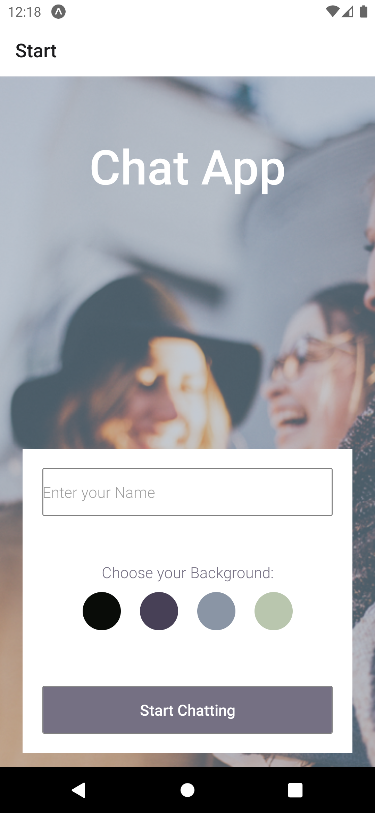

# React Native Chat App
 
This is a chat app for mobile devices built with React-Native.  It provides users with a chat interface where they can send/receive text messages and images as well as share their location.  It was a project for my full-stack web development bootcamp with CareerFoundry.  

## Demo

## Prerequisites

* Install Expo: npm install expo-cli -g
* For Windows and Linux: Install Android Studio. For more information on how to set up an emulator, refer to the documentation.
* For Mac: Install XCode.
* Install the Expo app on your mobile device (available in Google Play Store and Apple Store).

## Getting Started

1. To install all the dependencies, run npm i.
2. To start the app, run expo/npm start.
3. To launch the app on a physical device, scan the QR code in the Expo GUI.
4. To launch the app on an emulator, press "Run on Android device/emulator" in the Expo GUI.

## Built With

* [expo](https://docs.expo.dev/versions/latest/)
* [expo-image-picker](https://docs.expo.dev/versions/latest/sdk/imagepicker/)
* [expo-location](https://docs.expo.dev/versions/latest/sdk/location/)
* [expo-permissions](https://docs.expo.dev/guides/permissions/?redirected)
* [firebase](https://firebase.google.com/docs/firestore/)
* [react](https://react.dev/)
* [react-dom](https://www.npmjs.com/package/react-dom)
* [react-native](https://reactnative.dev/)
* [react-native-gifted-chat](https://github.com/FaridSafi/react-native-gifted-chat)
* [react-native-keyboard-spacer](https://www.npmjs.com/package/react-native-keyboard-spacer)
* [react-native-maps](https://docs.expo.dev/versions/latest/sdk/map-view/?redirected)
* [react-native-web](https://www.npmjs.com/package/react-native-web)
* [react-navigation](https://reactnavigation.org/docs/getting-started/)
* [react-navigation-stack](https://github.com/expo/react-navigation-stack)

## Database Information

This project uses Google/Firebase for data storage.  If you encounter any issues, refer to the [Firebase documentation](https://firebase.google.com/docs).  

### Set up Firestore for your React Native project

1. Sign in to Firebase, then click on the "Go to console" link.
2. Choose to start in test mode, so you don't need to create any security rules.
3. Install Firestore via Firebase in your project: `npm install firebase`.
4. Import Firestore in your `App.js` file:

    <code>const firebase = require('firebase');</code>
     
    <code>require('firebase/firestore');</code>    

1.  In the Firestore project in your browser, open "Settings" and then the "General" tab. Under the "Your apps" section, you can generate configurations for different platforms. Click "Firestore for Web" and copy the contents of the config object.

2. In your Chat.js file, create a constructor in the App class. Paste the copied data from the config object.

Example:

<code>firebase.initializeApp({  
  apiKey: "your-api-key",  
  authDomain: "your-authdomain", 
  databaseURL: "your-database-url", 
  projectId: "your-project-id", 
  storageBucket: "your-storage-bucket", 
  messagingSenderId: "your-messaging-sender-id", 
  appId: "your-app-id" 
});</code>

##### Note: Replace the configuration info with your own Firestore database details.

1. Create a reference to the Firestore collection:

<code>this.referenceMessages = firebase.firestore().collection('chat');</code>

Please let me know if there's anything else I can assist you with!
